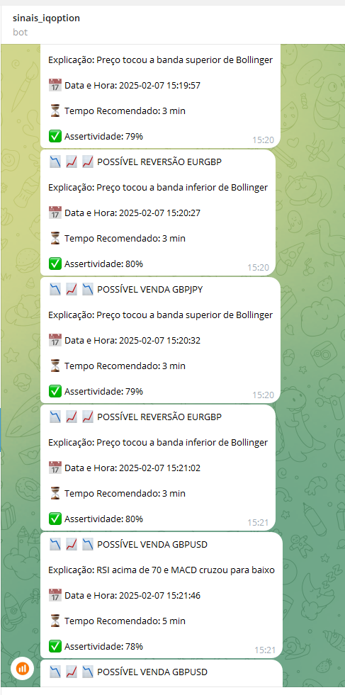

# 📌 Bot de Sinais para IQ Option 🚀

## 📖 Introdução
Este bot foi desenvolvido para **monitorar ativos da IQ Option** e **enviar sinais automáticos de compra e venda** diretamente para um canal no Telegram. Ele funciona **24 horas por dia, 7 dias por semana**, sem interrupção, identificando padrões técnicos de análise gráfica e fornecendo informações detalhadas sobre cada sinal detectado.

## 🎯 Funcionalidades
✅ **Monitoramento Contínuo:** Analisa ativos da IQ Option automaticamente.
✅ **Detecção de Padrões:** Identifica reversões, tendências e pontos de entrada baseados em análise técnica.
✅ **Envio Automático para o Telegram:** Publica sinais diretamente no canal configurado.
✅ **Gerenciamento de Erros:** Se um ativo falhar, o bot ignora e segue para o próximo sem interromper o funcionamento.
✅ **Reconexão Automática:** Caso a conexão com a IQ Option caia, ele se reconecta e continua normalmente.
✅ **Evita Sobrecarga da API:** Possui limitação inteligente de ativos para evitar bloqueios e instabilidades.
✅ **Configuração Personalizada:** O usuário pode definir os ativos monitorados e as estratégias utilizadas.
✅ **Baixo Consumo de Recursos:** Foi otimizado para rodar sem sobrecarregar o computador.

## 📊 Como os Sinais São Gerados
Os sinais são gerados com base em **indicadores técnicos**, incluindo:

- **Bandas de Bollinger:** Identifica reversões em regiões de sobrecompra e sobrevenda.
- **MACD (Moving Average Convergence Divergence):** Detecta cruzamentos de médias móveis exponenciais.
- **RSI (Relative Strength Index):** Verifica se o ativo está sobrecomprado ou sobrevendido.
- **Médias Móveis:** Filtra tendências e possíveis momentos de entrada e saída.
- **Volume:** Monitora variações de volume para identificar confirmações de tendência.

Cada sinal enviado para o Telegram contém:
📌 Nome do Ativo
📊 Explicação do Sinal
📅 Data e Hora
⏳ Tempo Recomendado para Operação
✅ Assertividade Estimada

## 📸 Exemplos de Sinais no Telegram



## ⚙️ Como Usar o Bot

### 📥 Instalação
1️⃣ **Baixe e instale o Python** (versão 3.8 ou superior).
2️⃣ **Instale as dependências** executando o comando:
```sh
pip install -r requirements.txt
```
3️⃣ **Configure suas Credenciais** editando o arquivo de configuração com seu e-mail e senha da IQ Option.
4️⃣ **Execute o Bot** usando o comando:
```sh
python iqbot.py
```

O bot iniciará a análise automaticamente e começará a enviar sinais para o Telegram configurado.

### 🔧 Configuração do Telegram
Para configurar o envio de sinais para um canal no Telegram:
1️⃣ **Crie um bot no Telegram** usando o BotFather.
2️⃣ **Obtenha o Token da API** e adicione ao arquivo de configuração.
3️⃣ **Configure o Chat ID do seu canal** e insira no código.
4️⃣ **O bot começará a enviar sinais automaticamente.**

## 🚨 Observações Importantes
🔹 **Não garantimos lucros**. Utilize os sinais como uma ferramenta auxiliar para sua análise.
🔹 **Customize os ativos monitorados** para otimizar a performance.
🔹 **O bot é otimizado para rodar 24/7**, mas a estabilidade pode depender da conexão com a IQ Option.
🔹 **Não abuse do uso da API** para evitar bloqueios.

## 🛠 Suporte e Contato
Dúvidas ou suporte? Entre em contato pelo Telegram: **[@astrahvhdev](https://t.me/astrahvhdev)**

---
**Desenvolvido para traders que desejam otimizar suas estratégias com sinais automatizados! 📈🔥**

